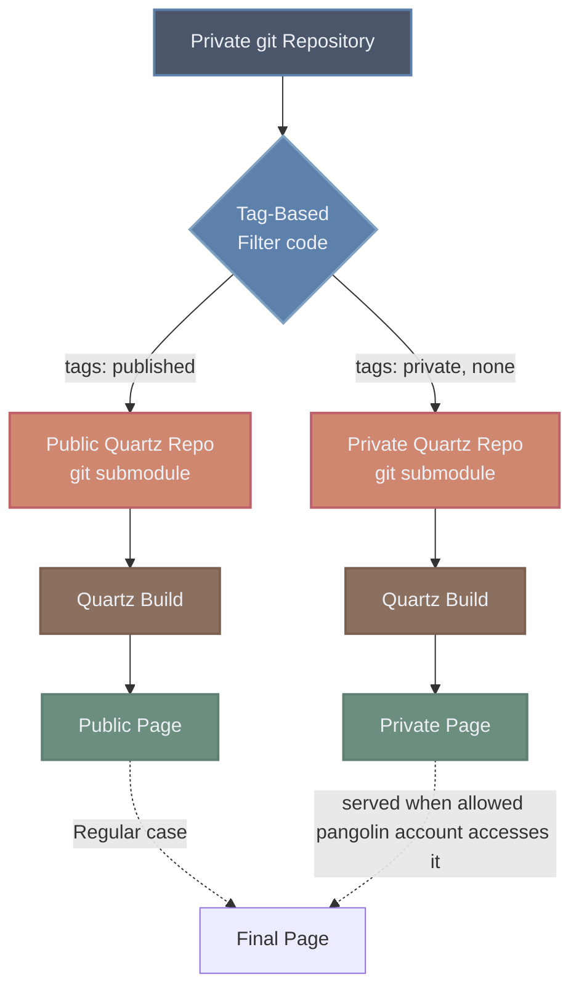

### Seperate sites based on tags
I would like to be able to publish to two different sites, from one repo, based on the frontmatter in de md files. I want the following behaviour:

publish: true => public site  
publish: false | nothing => private site 

Right now the `draft` field works fine, but the private pages are now not build into a site. 

I could probably overload the domain with logic so that guests on pangolin get sent to the public site but with my sso creds I get sent to my private site.

* [Authoring-content](https://quartz.jzhao.xyz/authoring-content)

Diagram of what I would implement, adapted from [this](https://rakshanshetty.in/blog/quartz-obsidian-multi-site-publishing) diagram:

I don't quite know if it is possible to set such a default behaviour in pangolin without seeing the pangolin screen. I'd like the private page to only be triggered when it detects my SSO being loaded in the cookie.  

### Redo docker container
Right now my docker container is rather hacky, based on [this](https://github.com/shommey/dockerized-quartz) repo. I think I would also like to have one docker container serve both sites.
